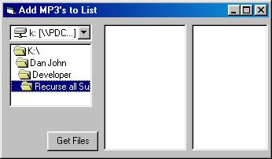



## Add all mp3 files to Listbox

### Description

Recurse through all subdirectories adding mp3 files to a listbox. I've seen some complex examples of code to do this task so thought I'd write a simple one.

You're comments and ratings would be appreciated.
 
### More Info
 

             |
---                |---
**Submitted On**   |2001-12-03 16:26:28
**By**             |[discodan](https://github.com/Planet-Source-Code/PSCIndex/blob/master/ByAuthor/discodan.md)
**Level**          |Intermediate
**User Rating**    |5.0 (30 globes from 6 users)
**Compatibility**  |VB 5\.0, VB 6\.0
**Category**       |[Sound/MP3](https://github.com/Planet-Source-Code/PSCIndex/blob/master/ByCategory/sound-mp3__1-45.md)
**World**          |[Visual Basic](https://github.com/Planet-Source-Code/PSCIndex/blob/master/ByWorld/visual-basic.md)
**Archive File**   |[Add\_all\_mp391631232001\.zip](https://github.com/Planet-Source-Code/discodan-add-all-mp3-files-to-listbox__1-29436/archive/master.zip)

